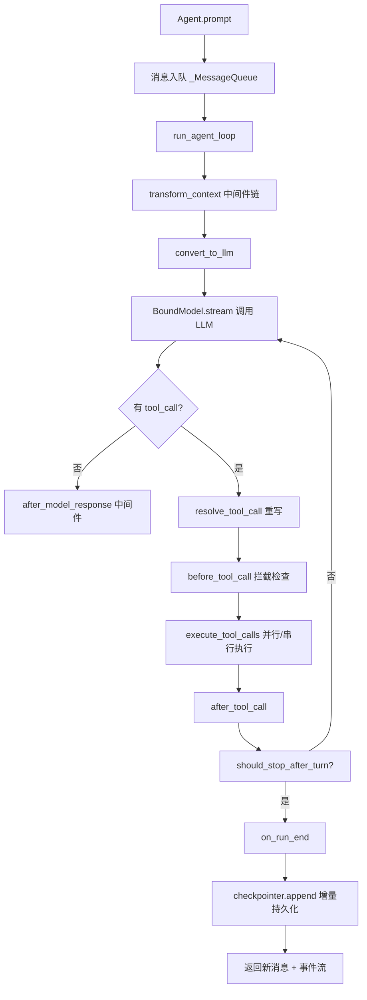

# CubePi 项目详解

> 整理日期：2026-08-31
> 项目版本：0.13.5（Beta）
> 仓库：https://github.com/cubeplexai/cubepi

---

## 一、项目定位

**CubePi** 是一个 Pythonic、async-native 的 Agent 框架，定位是 **langgraph 的轻量替代品**，设计灵感来自 **pi-agent-core**（Anthropic 的 Agent SDK）。核心哲学是：

> 把 Agent 逻辑建模为一个**线性 while 循环**（`run_agent_loop`），而不是图节点 + 边 + 状态机的状态机模型。开发者 5 分钟就能读懂整个运行时。

- 语言：Python ≥ 3.11
- 核心依赖仅 3 个：`pydantic`、`anthropic`、`openai`
- 其余功能全部做成 **optional extras**（`sqlite`/`postgres`/`mysql`/`mcp`/`tracing`/`trace-cli`）
- 构建工具：hatchling；包管理：uv

### 与 langgraph 的对比（来自官方 README）

| | langgraph | CubePi |
|---|---|---|
| **抽象** | 图节点 + 边 + channels，状态机建模 | 普通 async 函数，`run_agent_loop` 是 5 分钟能读完的 while 循环 |
| **流式** | 基于回调，多种 handler 类型 | `async for event in stream`，一种模式走天下 |
| **检查点** | 每步全量快照，每次 channel 变化都序列化整个消息列表 | Append-only，只写新增消息，DB I/O 与对话长度无关（O(1)） |
| **依赖** | langchain-core、langgraph-sdk 及传递依赖 | 3 个核心依赖 |
| **工具执行** | 工具是图节点，需手动接线 | 声明为函数即可，框架处理路由与并行执行 |
| **多 Provider** | 通过 langchain chat model 适配器 | 原生 `Provider` 协议，内置 Anthropic/OpenAI，一个类即可扩展 |
| **中间件** | 图级中间件（节点进出） | Agent 级中间件，8 个类型化钩子 + 声明式组合规则 |
| **可观测性** | LangSmith / Langfuse 集成 | 原生 OpenTelemetry，GenAI 语义约定，OTLP/JSONL 导出器内置 |

---

## 二、目录结构详解

### 根目录

| 文件/目录 | 作用 |
|---|---|
| `pyproject.toml` | 打包配置（hatchling）。核心依赖仅 3 个；其余功能全部做成 optional extras |
| `AGENTS.md` / `CLAUDE.md` | 给 AI 编码代理的开发规范：必须用 `uv`、必须建 worktree、spec→plan→code 流水线、AI 评审循环 |
| `dev/` | 开发文档：`specs/`（设计规格，按日期命名）、`plans/`（实现计划）、`runbooks/`（发布手册） |
| `examples/` | 可运行示例：天气 Agent、持久化聊天、Postgres/MySQL 检查点、多 Provider 故障转移、FastAPI 集成、研究协作等 |
| `skills/` | VS Code 技能包：`cubepi`（构建 Agent 的指南）、`cubepi-trace`（trace 调试） |
| `tests/` | 测试套件，与 `cubepi/` 镜像结构，`asyncio_mode=auto` |
| `website/` | Docusaurus 文档站（含 `versioned_docs/` 版本快照、`i18n/` 中英双语） |

### `cubepi/` 核心包

#### `providers/` — LLM 抽象层（对应 pi-ai）

| 文件 | 作用 |
|---|---|
| `base.py` | 核心类型：`Provider` Protocol、`Message`/`UserMessage`/`AssistantMessage`/`ToolResultMessage`、`StreamEvent`、`MessageStream`（异步迭代器）、`BoundModel`、`ReasoningControl`、`Usage` 等 |
| `anthropic.py` / `openai.py` / `openai_responses.py` | 三家官方实现 |
| `openai_compatible.py` | OpenAI 兼容协议实现，配合 `presets.py` 支持 DeepSeek、Qwen/百炼、Kimi、GLM |
| `fallback.py` | `FallbackBoundModel`：限流/宕机/上下文超长时自动切换备用模型 |
| `faux.py` | `FauxProvider`：**无 API 调用的确定性测试 Provider**，能模拟真实流式事件 |
| `capability.py` | 能力描述（是否支持工具、推理、温度等），用于 lint 和 payload 预览 |
| `models.py` / `reasoning_profiles.py` | 模型目录与推理档位 |
| `images/` | 图像生成 Provider 抽象 |

#### `agent/` — 运行时核心（对应 pi-core）

| 文件 | 作用 |
|---|---|
| `loop.py` | **框架的心脏**：`run_agent_loop` / `run_agent_loop_continue` / `run_agent_loop_resume`，无状态的 while 循环算法，所有中间件钩子以参数注入 |
| `agent.py` | `Agent` 类：有状态封装，管理消息队列、订阅事件、checkpointer、fork、HITL 绑定 |
| `tools.py` | 工具执行引擎：参数校验（Pydantic）、并行/串行执行、错误包装、HITL 追踪 |
| `tool_decorator.py` | `@tool` 装饰器：从函数签名自动生成 Pydantic 参数模型 |
| `types.py` | `AgentTool`、`AgentContext`、各类钩子上下文类型 |
| `_outcome.py` / `_tool_cycle.py` | 运行结果标记 / 工具循环检测（防死循环） |

#### `middleware/` — 可组合钩子层（CubePi 的独创）

| 文件 | 作用 |
|---|---|
| `base.py` | `Middleware` 基类 + `compose_middleware()`，定义 8 个类型化钩子（见下文） |
| `goal.py` | `GoalMiddleware`：目标管理 |
| `subagents.py` | `SubagentMiddleware`：子 Agent 编排 |
| `todo.py` | `TodoListMiddleware`：待办清单 |
| `compaction/` | 上下文压缩：`boundary.py`（边界检测）、`pruner.py`（裁剪）、`summarizer.py`（摘要）、`tokens.py`（token 估算）、`state.py` |

**8 个类型化钩子：**

| Hook | 组合规则 |
|---|---|
| `transform_context` | 链式 — 每个接收前一个的结果 |
| `convert_to_llm` | 最后一个实现生效 |
| `resolve_tool_call` | 第一个非 `None` 重写生效（短路） |
| `before_tool_call` | 任一拦截即停止执行 |
| `after_tool_call` | 后者覆盖前者 |
| `transform_system_prompt` | 链式 — 每个接收前一个的结果 |
| `after_model_response` | 返回 `TurnAction`；最后一个决策生效，消息拼接 |
| `should_stop_after_turn` | 任一返回 true 即停止 |
| `on_run_end` | 消息拼接；非空结果触发额外一轮模型调用 |

#### `checkpointer/` — 状态持久化

| 文件 | 作用 |
|---|---|
| `base.py` | `Checkpointer` Protocol：`load`/`append`/`save_extra`/`fork`/`snapshot`/HITL 请求持久化 |
| `memory.py` | 内存实现（开发/测试） |
| `sqlite.py` | SQLite 实现（`aiosqlite`） |
| `postgres/`、`mysql/` | 生产级实现（SQLAlchemy + asyncpg/aiomysql），**运行时零 DDL**，schema 由应用用 Alembic 管理 |

**关键设计**：append-only 语义——只写新增消息，DB I/O 是 O(1)，不随对话长度增长（对比 langgraph 每步全量快照）。

#### `hitl/` — Human-in-the-Loop（人工介入）

- `channel.py`：`HitlChannel` / `CheckpointedChannel` / `InMemoryChannel`
- `ask_user.py`：`ask_user_tool`
- `policy.py`：`Approve` / `Deny` / `AskUser` 决策
- `middleware.py`：`ApprovalPolicyMiddleware` / `ConfirmToolCallMiddleware`
- `binding.py`、`testing.py`（`ScriptedChannel` 测试用）、`exceptions.py`（一整套 HITL 异常）

#### `deferred/` — 延迟工具组（渐进式工具披露）

MCP 服务器多时工具 schema 会吃掉大量上下文。`DeferredToolGroup` 默认隐藏 schema，模型需要时通过内置 `load_tools` 工具按需展开。`dispatch` 策略下 tools 数组和 system prompt 字节级稳定，**加载工具不会失效 prompt 缓存**。

#### `mcp/` — MCP 集成

`stdio_loader.py` / `http_loader.py` 加载 MCP 工具，`_adapter.py` 适配到 `AgentTool`。

#### `tracing/` — 可观测性（OpenTelemetry）

- `tracer.py`（`Tracer`）、`meter.py`（指标）、`schema.py`（GenAI 语义约定常量）
- `exporters/`（JSONL/OTLP）、`recorder.py`、`content.py`（内容记录与脱敏）、`context.py`
- **懒加载设计**（PEP 562 `__getattr__`）：不装 OTel SDK 也能导入 schema 常量，保证 `trace-cli` 轻量安装可用

#### `cli/` — 终端工具

`cubepi trace` 子命令：

```bash
cubepi trace ls                 # 列出运行，最新在前
cubepi trace view <run_id>      # 树形渲染，错误内联显示
cubepi trace follow <run_id>    # 实时流式查看 span
cubepi trace stats --by model   # 按模型聚合 token/延迟/错误
```

#### `utils/`

- `emit.py`（事件发射）、`json_parse.py`（容错 JSON 解析）

---

## 三、核心架构：一次 `agent.prompt()` 的旅程



关键点：

- **事件流**：`async for event in agent.stream(...)` 是唯一模式，事件类型有 `text_delta`、`thinking_delta`、`toolcall_start` 等
- **中间件组合规则**是声明式的：`transform_context` 链式、`resolve_tool_call` 短路、`before_tool_call` 任一拦截即停、`after_model_response` 最后决定胜出
- **工具执行**：`@tool` 装饰器从函数签名生成 schema，框架自动处理参数解析、并行执行、错误包装

### 快速上手示例

```python
import asyncio
from cubepi import Agent, tool
from cubepi.providers.anthropic import AnthropicProvider

provider = AnthropicProvider(provider_id="anthropic", api_key="sk-...")

@tool
async def get_weather(city: str) -> str:
    "Get current weather for a city."
    return f"72°F and sunny in {city}"

agent = Agent(
    model=provider.model("claude-sonnet-4-5-20250929"),
    tools=[get_weather],
    system_prompt="You are a helpful weather assistant.",
)

def on_event(event, signal=None):
    if event.type == "text_delta":
        print(event.delta, end="", flush=True)

agent.subscribe(on_event)
asyncio.run(agent.prompt("What's the weather in Tokyo?"))
```

---

## 四、基于此项目开发 vs 原版 pi-agent（pi-agent-core）

### 先说明：两者是什么关系

CubePi 的 `dev/specs/2026-05-09-cubepi-framework-design.md` 明确写着 **"inspired by pi-agent-core"**，且 README 的对比表是拿 **langgraph** 做对手。所以它本质上是 pi-agent-core 的 **Python 重写 + 超集**。原版 pi-agent-core 是 TypeScript 的（Anthropic 官方 Agent SDK，`streamSimple`/`EventStream`/TypeBox schema）。

### 基于 CubePi 开发的优点

| 维度 | 说明 |
|---|---|
| **Pythonic 原生** | 全 Pydantic 类型、`async for` 流式、`@tool` 装饰器，无 TS 桥接层 |
| **依赖极简** | 核心 3 个依赖 vs pi 的 TypeBox + 各种运行时；可选功能全部 extra 化 |
| **中间件体系更强** | pi 只有 hook 回调；CubePi 有 8 个类型化钩子 + 声明式组合规则 + 内置 Goal/Todo/Subagent/Compaction 中间件 |
| **多 Provider 一等公民** | pi 主要面向 Anthropic；CubePi 原生支持 OpenAI、DeepSeek、Qwen、Kimi、GLM，还有 `FallbackBoundModel` 故障转移 |
| **生产级持久化** | append-only 检查点（SQLite/Postgres/MySQL），pi 的持久化要自己搭 |
| **可观测性内置** | OTel GenAI 语义约定 + `cubepi trace` CLI，pi 需要接 LangSmith 等外部服务 |
| **HITL 完整** | 审批/确认/提问通道 + 持久化 + 测试工具，pi 没有对等物 |
| **测试友好** | `FauxProvider` 确定性模拟流式，无 API key 也能跑测试 |
| **工程规范** | spec→plan→code 流水线、worktree 隔离、AI 评审、文档随功能发布 |

### 基于 CubePi 开发的缺点 / 风险

| 维度 | 说明 |
|---|---|
| **生态与社区** | pi-agent-core 有 Anthropic 官方背书 + 庞大 TS 社区；CubePi 是 0.13.x 的 Beta 项目，生态小，遇到问题主要靠读源码 |
| **成熟度** | 版本迭代快（0.5→0.7→0.13），API 可能变动；`AGENTS.md` 里大量"陷阱"记录说明边界情况多 |
| **TS 生态不可用** | 如果团队已有 pi-agent-core/TS 的 Agent 代码，迁移成本高 |
| **文档依赖源码** | `skills/cubepi/SKILL.md` 自己都说"文档不清楚就读源码"，文档站还在建设中 |
| **可选依赖的运维成本** | Postgres/MySQL 检查点要求应用自管 schema（Alembic），上手门槛比"开箱即用"高 |
| **无图编排** | 如果确实需要复杂 DAG/条件分支/循环图，while 循环模型要手写控制流（虽然中间件能覆盖大部分场景） |

### 结论建议

- **选 CubePi**：如果你在 Python 生态、需要多 Provider、生产级持久化、内置可观测性，且 Agent 逻辑以"线性循环 + 工具调用"为主（绝大多数场景）
- **选 pi-agent-core**：如果你深度绑定 Anthropic、需要 TS 生态、或需要官方支持
- **两者都行**：如果只是快速原型，CubePi 的 `FauxProvider` + 极简 API 上手更快

---

## 五、开发环境速查

```bash
uv sync --all-extras --dev               # 安装全部依赖
uv run pytest tests/                      # 运行测试（asyncio_mode=auto）
uv run pytest tests/path/test.py::test -v # 运行单个测试
uv run ruff check cubepi/ tests/          # lint
uv run ruff format --check cubepi/ tests/ # 格式检查（CI 只检查不修复）
uv run mypy cubepi                        # 类型检查
```

### 开发工作流（AGENTS.md 要求）

1. **先建隔离 worktree**：`.worktrees/YYYY-MM-DD-<topic>`，分支 `YYYY-MM-DD-<topic>`，绝不在 `main` 上直接开发
2. **Spec 阶段要协作**：先和用户确认需求再写 spec，研究 pi-agent-core / langgraph / claude code 的先例，spec 放 `dev/specs/`
3. **本地 AI 评审循环**：spec/plan/code 就绪后，征得用户同意再进入自动评审循环
4. **文档随功能发布**：每个功能必须更新 `website/docs/`，无文档不算完成
5. **PR AI 评审循环**：开 PR 后每 ~2 分钟轮询反馈，修复后请求复审，直到干净 + CI 通过

### 发布注意（runbook 摘要）

- 发布 `X.Y` 时需冻结 `website/versioned_docs/version-X.Y/`（含 zh-Hans 镜像）
- `pnpm apiref` 必须先于 `pnpm docusaurus docs:version X.Y` 执行
- 详见 `dev/runbooks/cut-doc-version.md`

---

## 六、关键设计决策速查

| 决策 | CubePi 的做法 | 理由 |
|---|---|---|
| 循环 vs 图 | 线性 while 循环 | 可读、可调试、可追踪 |
| 检查点 | append-only 增量写 | O(1) DB I/O，不随对话增长 |
| 工具 schema | Pydantic 模型 → JSON Schema | Python 标准 |
| API key 位置 | Provider 构造函数 | 配置属于初始化而非每次请求 |
| Provider 抽象 | `Provider` 实例 + `MessageStream` | 更 Pythonic，易测试/模拟 |
| 追踪 | OpenTelemetry GenAI 语义约定 | 可接入任意 OTLP 后端 |
| 工具披露 | DeferredToolGroup 按需加载 | 省上下文，不失效 prompt 缓存 |
| 测试 | FauxProvider 确定性流式 | 无 API 调用，CI 可跑 |